# LEX-IA

Transcripteur audio/vidéo local propulsé par GPU NVIDIA.

## Stack
- **Canary-Qwen-2.5B** (NeMo) — anglais, chunking 40s
- **Whisper large-v3** (faster-whisper) — toutes les autres langues
- **yt-dlp** — extraction audio YouTube
- **ffmpeg** — conversion audio
- **Flask** — serveur web local

## Prérequis
- Python 3.11 ou 3.12
- GPU NVIDIA avec CUDA 12.8
- ffmpeg dans le PATH
- Git (pour l'installation de NeMo)

## Installation
```bat
install.bat
```

## Lancement
```bat
run.bat
```
Ouvre http://localhost:5000

## Mise à jour yt-dlp
```bat
update.bat
```

## Architecture



## Fonctionnalités
- URL YouTube ou fichier local (drag & drop)
- Détection automatique de la langue
- Routage intelligent vers le meilleur modèle
- Console IA en temps réel
- Export transcript en .txt
